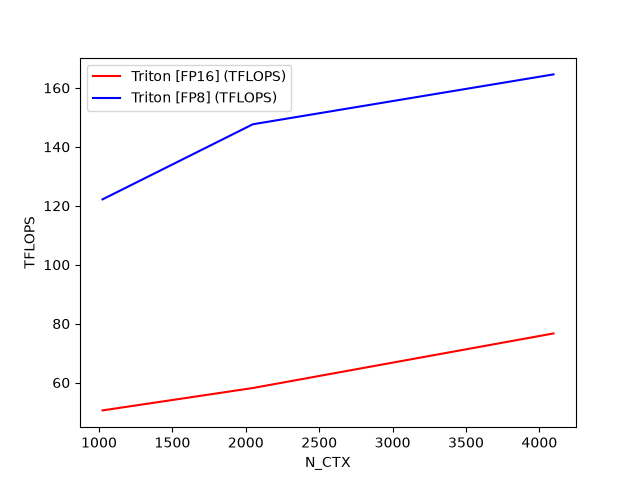

# Triton Kernels

This repository documents my exploration of GPU memory hierarchy optimizations, specifically focusing on Transformer self-attention.
By deconstructing the architectural mechanics of FlashAttention and FlashAttention-2, I built custom Triton kernels which optimize their respective algorithms for memory efficiency.
The kernels and benchmarks below are explicitly altered and tuned for the Blackwell architecture (NVIDIA RTX 5070 Ti).

Note: The core FlashAttention-2 implementation is heavily based on the official Triton tutorial. 
My primary focus in this repository was deconstructing, annotating, and benchmarking this complex reference code to bridge the gap between the theoretical paper and actual hardware execution on my RTX 5070 Ti.

## Tiled MatMul

Here you can see that my tiled matrix multiplication kernel achieves cuBLAS-level TFLOPS on FP16

FP8 achieves almost double the throughput of FP16 in tiled matrix multiplication using the same kernel

## Fused Softmax

This is a simple fused softmax kernel where we do all of the softmax steps in one kernel.
This kernel rivals the pytorch implementation.

## FlashAttentionv2

This kernel implements the FlashAttentionv2 algorithm with combines the original "online softmax" algorithm from the first FlashAttention paper with some additional
memory optimisations (mostly for the forward pass) As you can see from the benchmark, FP8 is generally twice as fast as FP16
